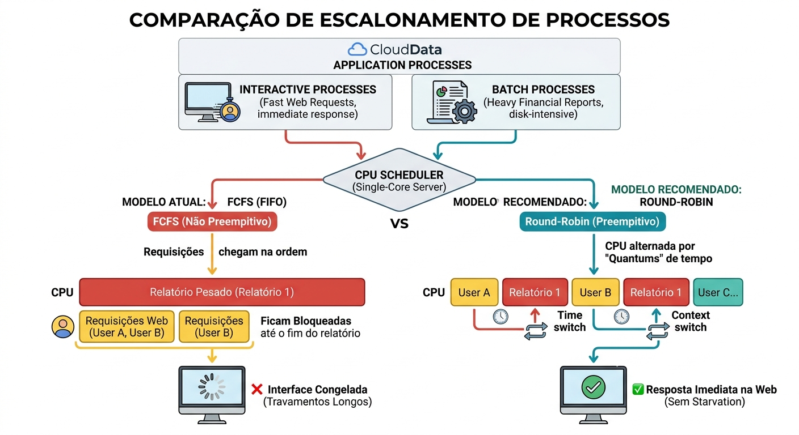

# Diário de Bordo — Escalonamento de Processos na CloudData

## 1. Contexto do Ambiente

A startup **CloudData** está implantando sua nova aplicação em um servidor de núcleo único (*single-core*). O sistema lida simultaneamente com dois perfis distintos de carga de trabalho:

- **Processos Interativos:** Requisições rápidas de usuários na interface web que exigem baixíssima latência e resposta imediata.
- **Processos Batch (Lote):** Geração de relatórios financeiros pesados, caracterizados por alto uso de processamento e operações intensivas de E/S (*I/O bound* no disco).

---

## 2. Diagnóstico do Problema

* **Algoritmo Atual:** First-Come, First-Served (FCFS / FIFO)
* **Comportamento:** Processamento estritamente por ordem de chegada.
* **Impacto Negativo:** Congelamento e travamento da interface web (*head-of-line blocking*).
* **Causa Raiz:** O FCFS é um algoritmo **não preempitivo** (não interrompe forçadamente um processo em execução). Quando um relatório pesado entra na CPU, as requisições rápidas dos usuários ficam bloqueadas até a conclusão total do relatório.

---

## 3. Proposta de Solução e Decisões de Arquitetura

### 3.1. Algoritmo Recomendado: Round-Robin (RR)
* **Mecanismo:** Distribuição do tempo de CPU em fatias de tempo fixas (*quantums*).
* **Benefício:** Por ser um modelo **preempitivo**, o sistema alterna rapidamente entre as tarefas. As requisições rápidas são atendidas nos intervalos entre os ciclos do relatório, eliminando os travamentos perceptíveis na interface.

### 3.2. Decisão de Design: Ausência de Escalonamento por Prioridade Fixa
* **Motivação:** Evitar o fenômeno de **Starvation** (Inanição).
* **Justificativa:** Se adotássemos prioridades fixas onde os processos interativos tivessem prioridade máxima, um alto fluxo contínuo de usuários impediria que os relatórios em lote fossem concluídos, deixando-os infinitamente na fila de espera.

---

## 4. Conclusão

A transição do modelo não preempitivo **FCFS** para o modelo preempitivo **Round-Robin** garante uma experiência fluida para os usuários da interface web, mantendo o progresso consistente das tarefas em lote sem o risco de *starvation*.

## Referências

PROF. SANTIAGO - PROGRAMAÇÃO E CIÊNCIA. **Me Salva Sistemas Operacionais: Motivação para Utilização de Escalonamento de Processos**. YouTube, 12 nov. 2022. Disponível em: <https://www.youtube.com/watch?v=BUnnIzc6_As>. Acesso em: 1 out. 2026.